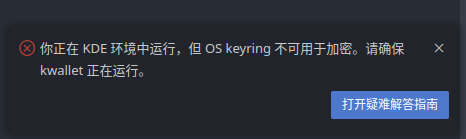
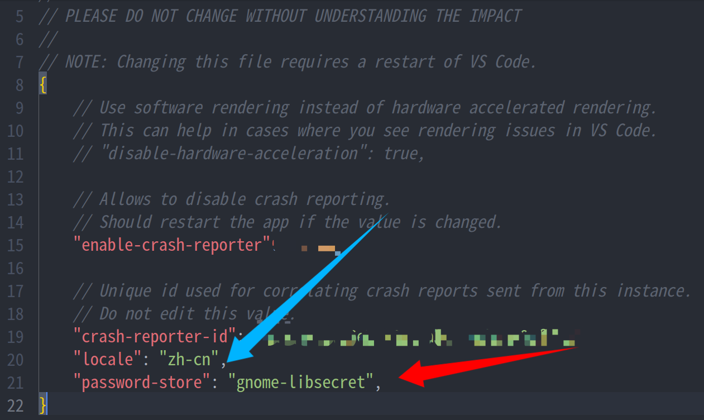

## 故障现象

vscode在同步登陆/插件登陆后提示“os keyring不可用于加密，请确保kwaller正在运行，提示信息如图：




## 使用gnome-keyring

1. 安装`gnome-keyring`

```bash
sudo oma install gnome-keyring
```

2. 在`vscode`中启用`gnome-keyring`

* 方式一：编辑`～/.vscode/argv.json`，在最后一个配置项后添加以下内容，保存并重启`vscode`

```json
	"password-store": "gnome-libsecret",
```

* 方式二：在`vscode`中，使用快捷键`CTRL + shift + P`，打开命令面板，找到`首先项: Configure Runtime Arguments`并打开：


在打开的配置文件中，添加以下项，保存并重启`vscode`。

```json
	"password-store": "gnome-libsecret",
```
注意：每一项配置应以`,`结尾，参考下图



接下来，您就可以享用`vscode`了！

## 额外事项

1. 根据`vscode`官方文档，其在`kde`桌面环境上可以使用`kwalletmanager5（org.kde.kwalletmanager5）`来管理加密，但AOSCOS上的`kwalletmanager5`打开后无响应。故障原因是`discover`中的`kwalletmanager5`为`flatpak`版，此版本存在兼容性问题。建议用户使用`oma`安装`kwalletmanager5`：

```bash
sudo oma install kwalletmanager
```

## 参考资料

[Setting Sync in Visual Studio Code](https://code.visualstudio.com/docs/editor/settings-sync#_recommended-configure-the-keyring-to-use-with-vs-code)